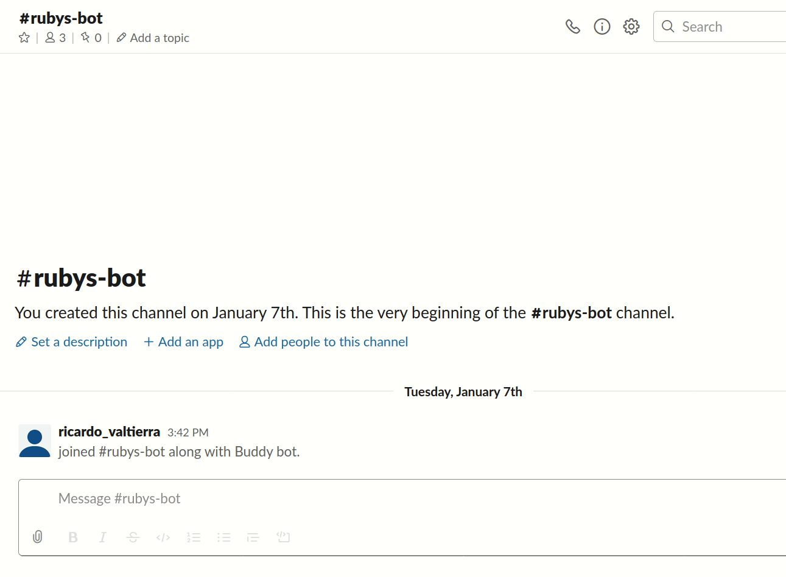
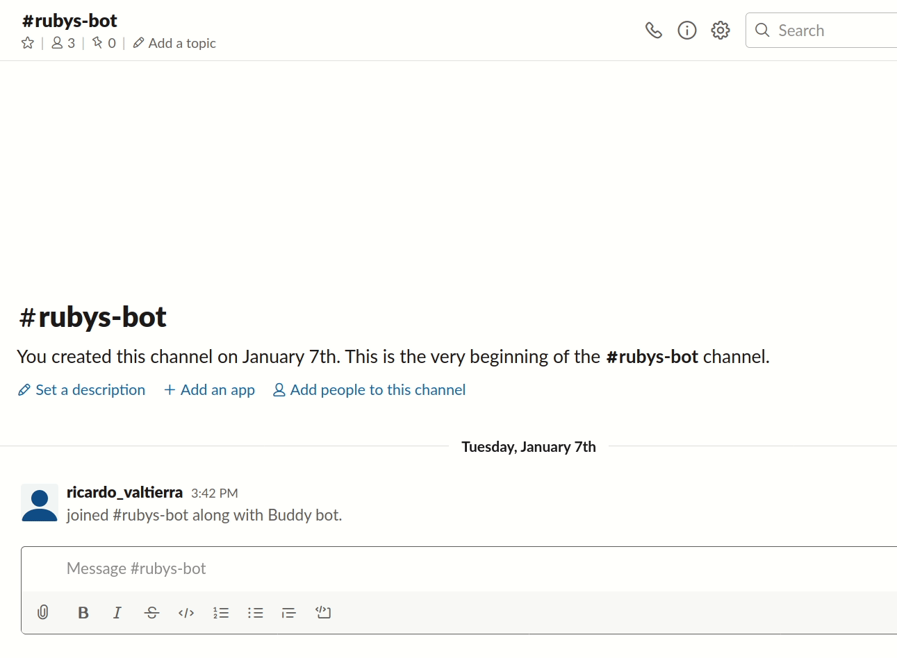

Slackbot
==============

Microverse Capstone Project consisting a bot deveolped to interact with Slack users on a given Workspace. Build yours!

## What it does?
It allows you to make a quick search by asking your bot without leaving Slack. Some example questions may be:

But if you try something he may not know:

## How it works?
The Bot is working based upon the following resources:

- [Slack-Ruby-Bot](https://github.com/slack-ruby/slack-ruby-bot#slack-ruby-bot)
- [Slack API](http://api.slack.com)
- [Wolfram API](http://account.wolfram.com/wolframid)

And powered by:

- Ruby
- Slack
- YML

## Usage
### Step 1: Clone and install dependencies

