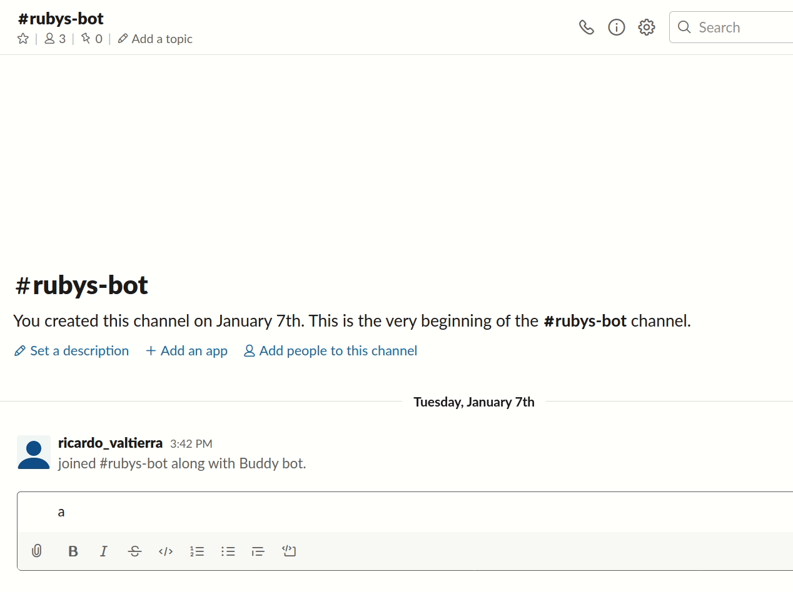
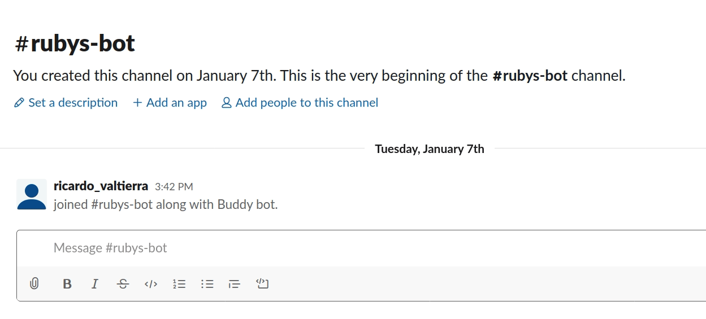

Slackbot
==============

Microverse Capstone Project consisting a bot deveolped to interact with Slack users on a given Workspace. Build yours!

## What it does?
It allows you to make a quick search by asking your bot without leaving Slack. Some example questions may be:

But if you try something he may not know:

## How it works?
The Bot is working  on top of the following resources:

- [Slack-Ruby-Bot](https://github.com/slack-ruby/slack-ruby-bot#slack-ruby-bot)
- [Slack API](http://api.slack.com)
- [Wolfram API](https://account.wolfram.com/auth/sign-in)

And powered by:

- Ruby
- Slack
- YML

## Usage
### Step 1: Clone and install dependencies
Clone the repo and run `bundle install` to get all the gems on your terminal.
### Step 2: Get your tokens for Slack & Wolfram APIs
You will have to register on [WolframID](http://account.wolfram.com/wolframid) and [Slack Bot Integration](http://slack.com/services/new/bot) to get your access tokens (for a register tutorial on Slack and Wolfram click [here](TUTORIAL.md)). Once that done just paste on your `.env` file. 
### Step 3: Add your bot to a channel and run
You're almost done with code part. Now just execute with `rackup` and have fun! Above are some examples, but feel free to see description of each command with '@your_bot's_name are you there?' or '@your_bot's_name help'

Also feel free to play with the code for some commands, like changing responses or adding them on `bot.rb`

## 🤝 Contributing

Contributions are more than welcome! feel free to check [issues page](http://github.com/ricardovaltierra/slackbot/issues/).

1. Fork (https://github.com/ricardovaltierra/slackbot/development/fork)
2. Create your working branch (git checkout -b [branch_name])
3. Commit your changes (git commit -am 'what you will add or fix or improve')
4. Push (git push origin [branch_name])
5. Create a PR

## 🤖 contributor

riacrdo valtierra - [GitHub](https://github.com/ricardovaltierra)

## 🙋‍♂ support :)

Give a ⭐️ if you liked it!

## 📝 license

This project is under the [MIT](LICENSE) license.
