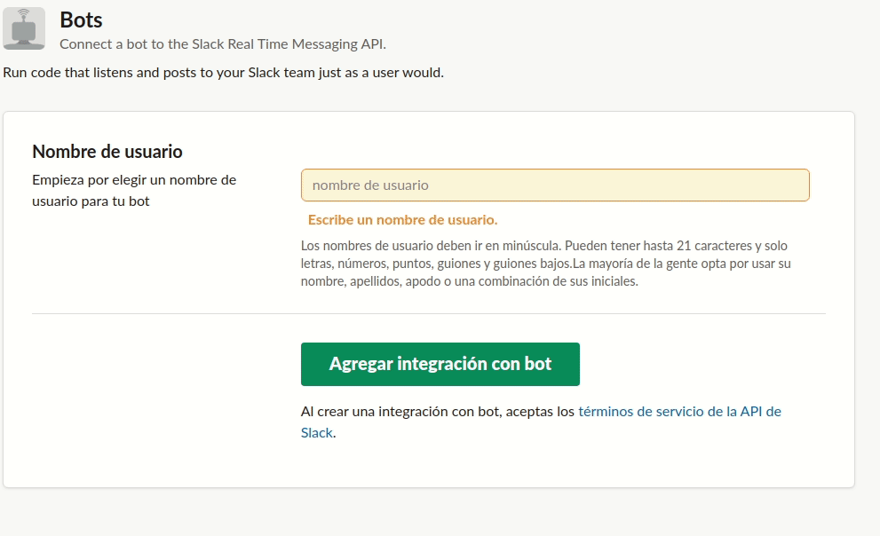
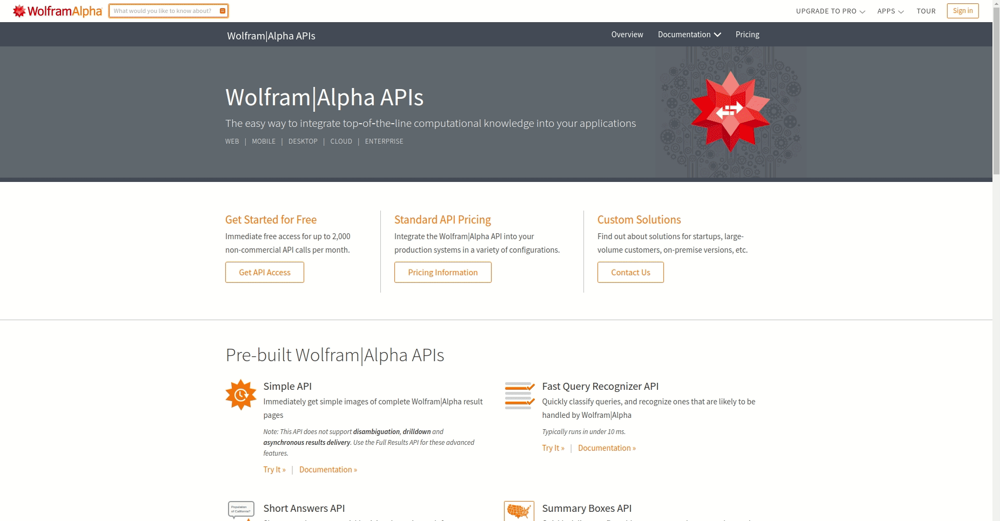

## Register Bot Tutorial

In this tutorial we'll register our [Slack Bot Integration](http://slack.com/services/new/bot) and [Wolfram API](https://account.wolfram.com/auth/sign-in) to get our access tokens.

### Slack API

1. Once on the [bot](http://slack.com/services/new/bot) section, type Bot's name and click Add
2. Copy your token and fill out as many fields as you want, altough I recommend to give an avatar and description. Click Save
3. Once we are on our channel, just click 'Add an app' and select it

### Wolfram API

1. On the [auth page](https://account.wolfram.com/auth/sign-in) click 'Create one'
2. Fill out the fields and click 'Create a Wolfram ID'
3. Now that you have credentials go [here](https://products.wolframalpha.com/api/) on Get API Access
4. Go 'Sign up to get your first AppID' and fill all the required fields
5. Remember to copy your AppID

